# BetterX-Android
BetterX-Android is a data collection app used in the [BetterX.org](http://www.betterx.org) research project.  BetterX-Android works on the background and collects device, network and sensor data.

## Functionality
It consists of 5 parts: the sensor logger, the network logger, the firefox extension web logger (see [BetterX-Firefox](https://github.com/eliasall/BetterX-Firefox)), the features logger (device data) and the main body application which provides the setup and GUI to the user.  All parts produce json formatted data files which are relayed back into AWS s3 on a daily basis.

### Setup Parameters
AWS_S3_ACCESSKEYID _access key for s3_
AWS_S3_SECRETKEYACCESS _secret key for s3_
AWS_S3_USERNAME _username for s3_
AWS_S3_BUCKET _folder for s3_
PUB_KEY _public key for encrypting zip file before sending it over_
GCM_PROJECT_NUMBER _Google Cloud Messaging API Key_

### Sensor Logger
The purpose of the sensor logger is to monitor and record sensor data including location data.  The [SensorManager](https://github.com/emotionsense/SensorManager) library provides most of the functionality for sensor reading and the [SensorDataManager](https://github.com/emotionsense/SensorDataManager) provides most of functionality to send the data. The sensor logger uses the adaptive sampling mechanism in order to reduce the volume of the recorded data.

* Environment Sensors
  * AMBIENT_TEMPERATURE
  * LIGHT			
* Pull Sensors
  * ACCELEROMETER
  * GYROSCOPE
  * LOCATION (Latitude, Longitude, Accuracy, Speed, Bearing, Provider, Time)
  * MAGNETIC_FIELD
  * WIFI (SSID, BSSID, Capabilities, Level, Frequency)
* Push Sensors
  * BATTERY
  * CONNECTION_STATE
  * CONNECTION_STRENGTH
  * LOCATION
  *	SCREEN
  *	Phone State
  * Step Counter

### Network Logger
The purpose of the netlogger is to monitor and record all the device network status changes.  The Network Logger uses this [Network Events Library](https://github.com/pwittchen/NetworkEvents).

* WifiStatus
*	MobileStatus
*	WiMaxStatus
*	HasInternet
* DetailedState
* ExtraInfo
* Capabilities
* LinkProperties
*	BSSID	
*	SSID
*	Frequency
*	SignalStrength
*	IP
*	LinkSpeed
*	MAC
*	NetID
*	RSSI
*	Available Networks

### Features Logger
* UID (IMEI+MEID+SIMSERIAL+ANDROID_ID)
* Device Manufacturer
* Device Model Number
* Android Version
* Screen Size
* Running Apps

### Main App Screens
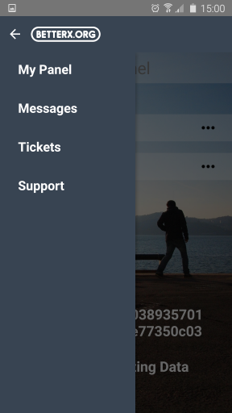
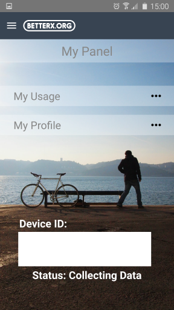

### Info Screens
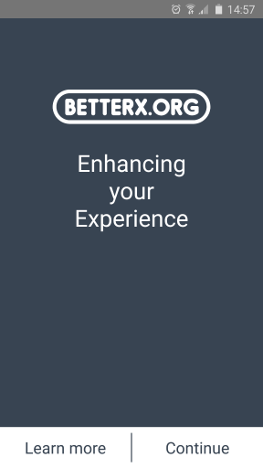
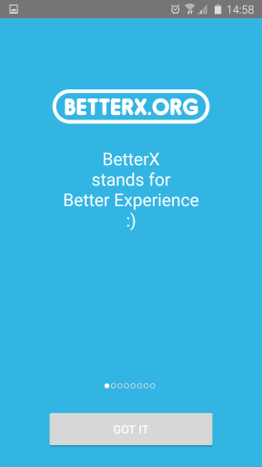
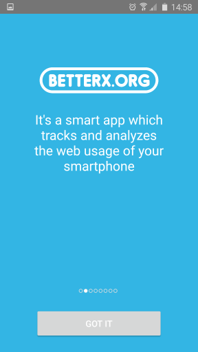
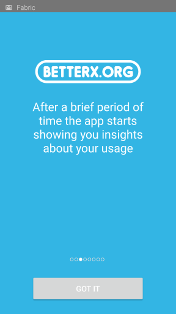
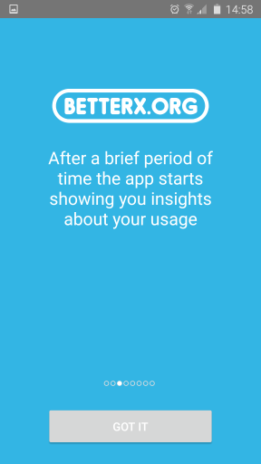
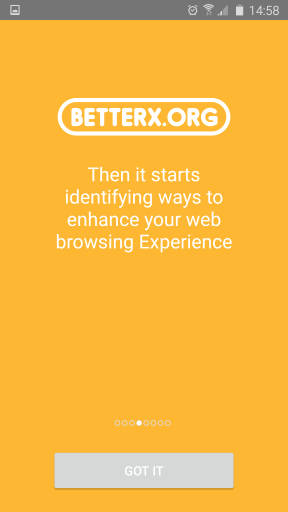

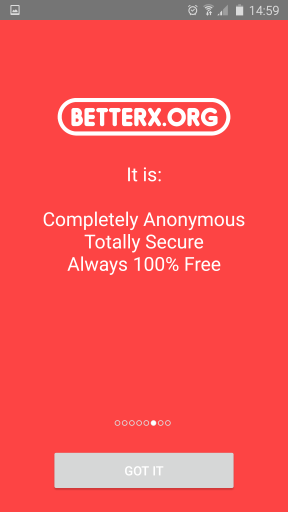

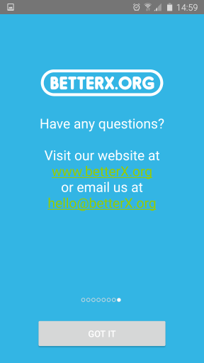

### Setup Screens
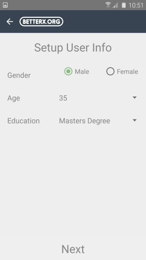

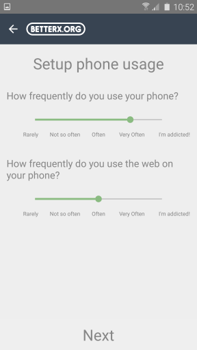

### Referencing
Usage of any parts of this software or data requires referencing in any published or publicised work. The correct referencing is presented below in Harvard, MLA8 and APA styles.
 
Harvard

`Allayiotis, E. (2017) BetterX System. N.A: BetterX.org.`
 
MLA8

`Allayiotis, Elias. “BetterX System.” 23 Feb. 2017, www.betterx.org.`
 
APA

`Allayiotis, E. (2017). BetterX System (Version 1.2). [Application software]. Retrieved from <http://www.betterx.org/>`

### License
Anyone interested in this project can download/modify/contribute to the source code that is made available.   The BetterX project is licenced under the Apache License, Version 2.0

_Copyright 2017 Elias Allayiotis_

_Licensed under the Apache License, Version 2.0 (the "License"); you may not use this file except in compliance with the License. You may obtain a copy of the License at http://www.apache.org/licenses/LICENSE-2.0_

_Unless required by applicable law or agreed to in writing, software distributed under the License is distributed on an "AS IS" BASIS, WITHOUT WARRANTIES OR CONDITIONS OF ANY KIND, either express or implied. See the License for the specific language governing permissions and limitations under the License._
